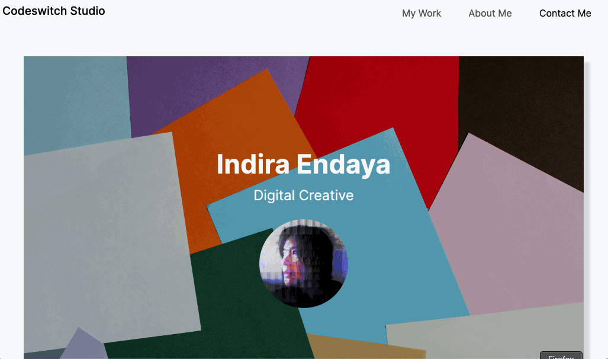

# Portfolio challenge 

Made for challege 3 of the Front-end Web Dev Bootcamp, this builds on my earlier portfolio layout [Digital Folio-01] (https://codeswitchstudio.github.io/digital-folio-01/) using the [Bootstrap] (https://getbootstrap.com/) CSS Framework and applying learnings from Exercises on customizing the css.

## Description

This is a portfolio of work meant to showcase my skills and talents to clients or employers who need a front-end developer with a background in graphic design.

Except for the first project which is the first version of this portfolio, I created all the content at different periods in my learning journey prior to the bootcamp. As the bootcamp course progresses and more projects are deployed, I will have more to showcase my strongest works as well as the thought processes behind it. 

## Usage

This is made for web browsers on Desktops or laptops but is also responsive.
Screenshot below

![screen recording in gif format scrolling down the page of the portfolio]

## Deployment
Link to the deployed application
[Bootstrap-Portfolio] (https://codeswitchstudio.github.io/bootstrap-portfolio/)

## Credits

Thank you to our bootcamp instructor Laura Cole, Student Success Advisor Jesse Pacheco, our pod TA Kimberly Rodriguez, and my patient tutors Ashton Foston and Samuel Cordova.

Photo credit for the hero image Kelly Sikkema via [Unsplash] (https://unsplash.com/@kellysikkema)

[Stackoverflow]
(https://stackoverflow.com/questions/15493828/web-button-that-hovers-and-displays-drop-shadow-on-mouseover)

Another reference for how to make the footer [Web-eau-net] (https://web-eau.net/en/blog/10-best-footer-html-css-snippets)

Other tools used:

Figma and Excalidraw

## License

MIT License

Copyright (c) 2023 Indira Endaya

Permission is hereby granted, free of charge, to any person obtaining a copy
of this software and associated documentation files (the "Software"), to deal
in the Software without restriction, including without limitation the rights
to use, copy, modify, merge, publish, distribute, sublicense, and/or sell
copies of the Software, and to permit persons to whom the Software is
furnished to do so, subject to the following conditions:

The above copyright notice and this permission notice shall be included in all
copies or substantial portions of the Software.

THE SOFTWARE IS PROVIDED "AS IS", WITHOUT WARRANTY OF ANY KIND, EXPRESS OR
IMPLIED, INCLUDING BUT NOT LIMITED TO THE WARRANTIES OF MERCHANTABILITY,
FITNESS FOR A PARTICULAR PURPOSE AND NONINFRINGEMENT. IN NO EVENT SHALL THE
AUTHORS OR COPYRIGHT HOLDERS BE LIABLE FOR ANY CLAIM, DAMAGES OR OTHER
LIABILITY, WHETHER IN AN ACTION OF CONTRACT, TORT OR OTHERWISE, ARISING FROM,
OUT OF OR IN CONNECTION WITH THE SOFTWARE OR THE USE OR OTHER DEALINGS IN THE
SOFTWARE.
